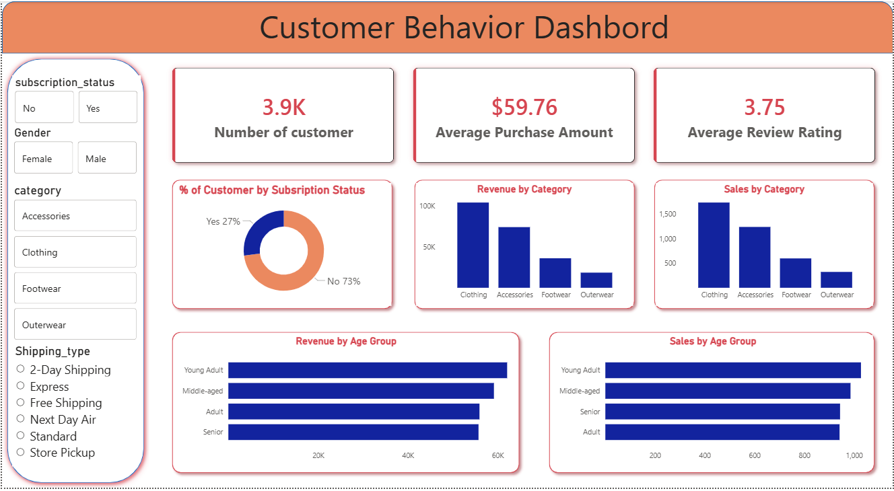

# 🛒 Customer Shopping Behavior Analysis

## 📌 Project Overview

This project analyzes customer shopping behavior using **Python, SQL, and Power BI** to uncover purchasing patterns, customer preferences, and business trends. The goal is to transform raw retail data into meaningful insights that support data-driven business decisions.

The project covers the complete data analytics workflow, including data cleaning, exploratory data analysis (EDA), SQL-based analysis, interactive dashboard creation, and business recommendations.

## 🎯 Objectives

* Clean and preprocess customer shopping data.
* Perform Exploratory Data Analysis (EDA).
* Analyze data using SQL queries.
* Build an interactive Power BI dashboard.
* Generate actionable business insights and recommendations.

## 🛠️ Tech Stack

* **Python** (Pandas, NumPy, Matplotlib, Seaborn)
* **SQL (PostgreSQL)**
* **Power BI**
* **Jupyter Notebook**

## 📊 Key Features

* Data Cleaning & Preprocessing
* Exploratory Data Analysis (EDA)
* SQL Business Analysis
* Interactive Power BI Dashboard
* Business Insights & Recommendations

# 📊 Power Bi Dashboard

**Preview:**

## 🚀 Skills Demonstrated

* Data Analysis
* Data Visualization
* SQL
* Power BI
* Business Intelligence
* Data-Driven Decision Making

